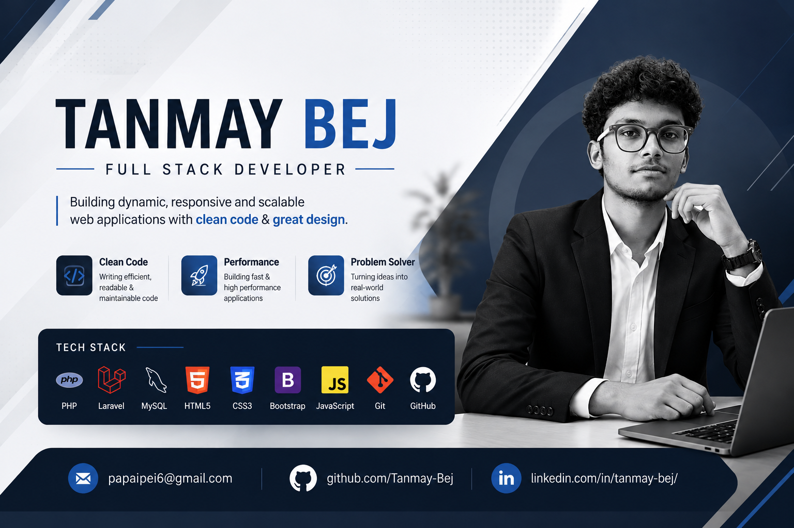

<h1 align="center">Tanmay Bej</h1>

  <b>Full Stack Developer | Laravel Specialist</b> 
  Building Scalable, Secure & High-Performance Web Applications

  <a href="mailto:papaipei6@gmail.com">Email</a> •
  <a href="https://www.linkedin.com/in/tanmay-bej/">LinkedIn</a>

---

## About Me

Results-driven Full Stack Developer specializing in backend engineering with Laravel.  
Focused on building scalable systems, clean architectures, and efficient APIs.

- Strong foundation in PHP & MVC architecture  
- Experience in real-world application development  
- Passion for clean, maintainable, production-ready code  

---

## Tech Stack

**Backend**
- PHP
- Laravel (REST APIs, MVC, Authentication)

**Frontend**
- HTML5, CSS3, JavaScript
- Bootstrap

**Database**
- MySQL (Design, Optimization)

**Tools**
- Git & GitHub
- VS Code

---

## Key Projects

### 🔹 Laravel Application System
- Built a structured Laravel-based application
- Implemented MVC architecture and routing
- Integrated database with MySQL

### 🔹 API Development Project
- Designed RESTful APIs
- Implemented CRUD operations
- Focused on performance and scalability

### 🔹 Portfolio & GitHub Projects
- Clean and structured repositories
- Continuous improvements and commits

---

## GitHub Activity

Consistently contributing to personal and collaborative projects, focusing on backend systems and Laravel development.

---

## Professional Strengths

- Clean Code & Scalable Architecture  
- Problem Solving & Debugging  
- Backend System Design  
- API Development  
- Continuous Learning  

---

## Career Objective

To work in a professional environment where I can contribute to real-world projects, enhance my technical expertise, and deliver impactful software solutions.

---

## Contact

- 📧 Email: papaipei6@gmail.com  
- 💼 LinkedIn: https://www.linkedin.com/in/tanmay-bej/  

---

## Professional Statement

Committed to writing high-quality code and building efficient, scalable web applications aligned with modern development standards.
